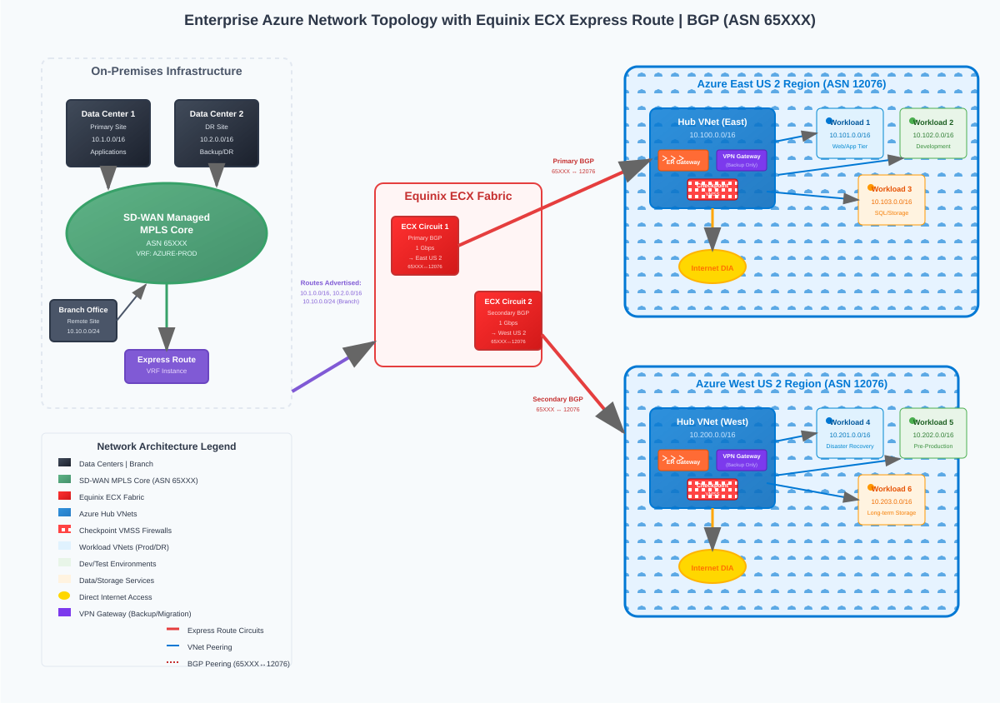
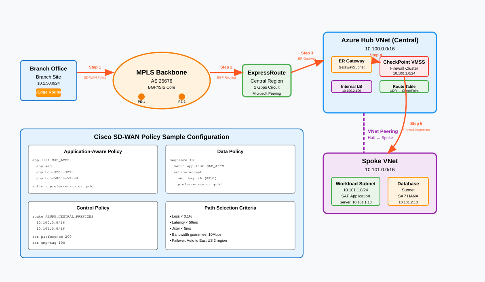
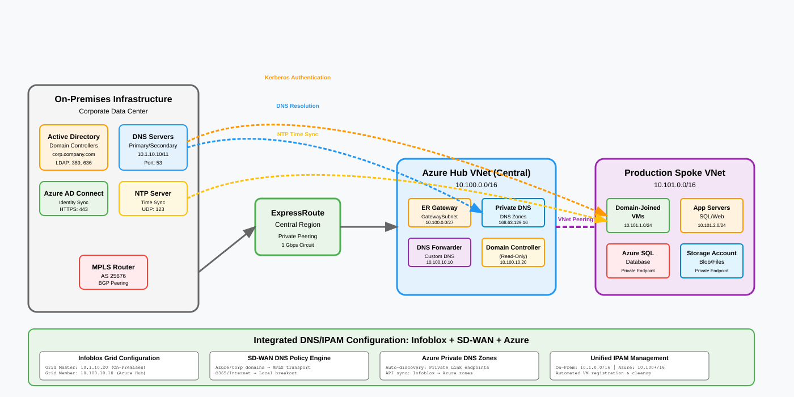
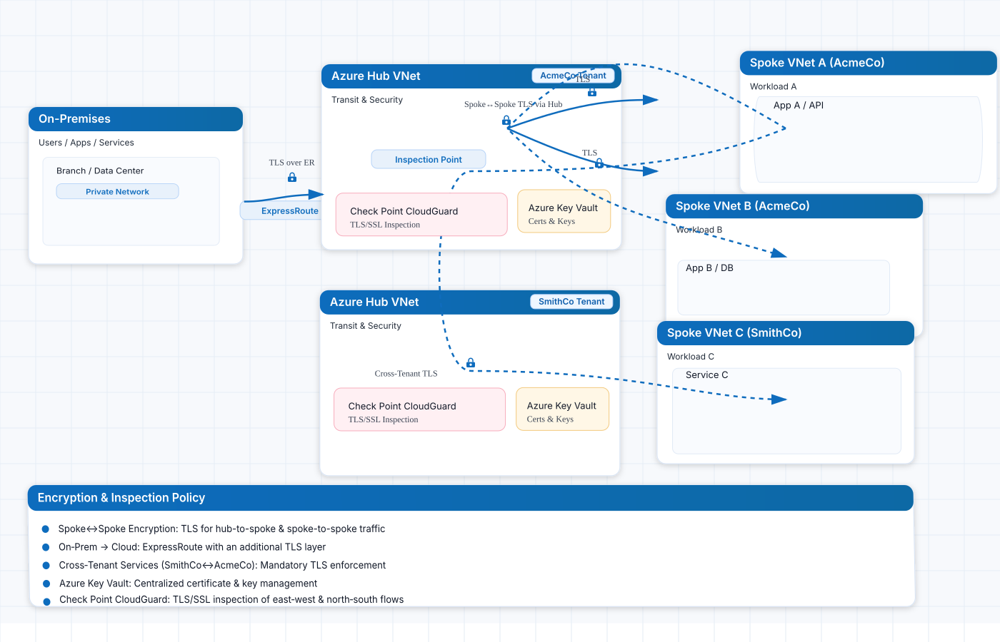
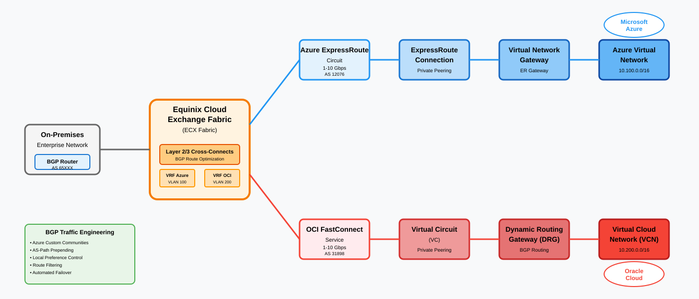
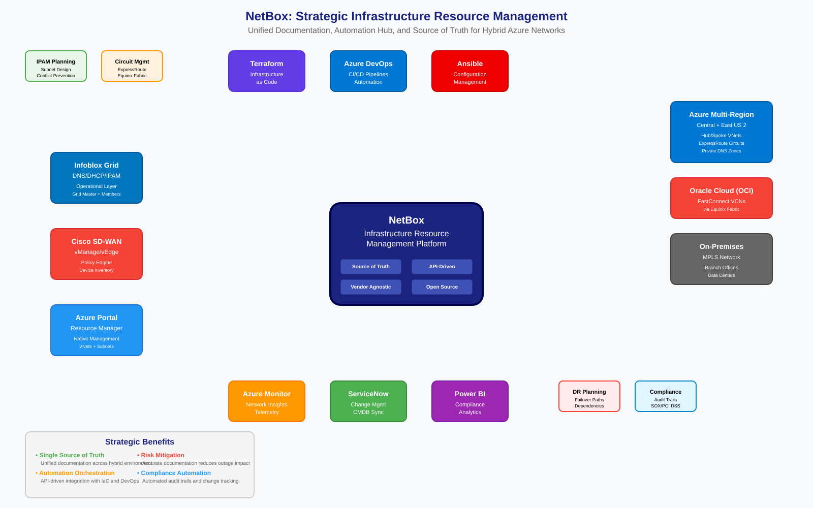
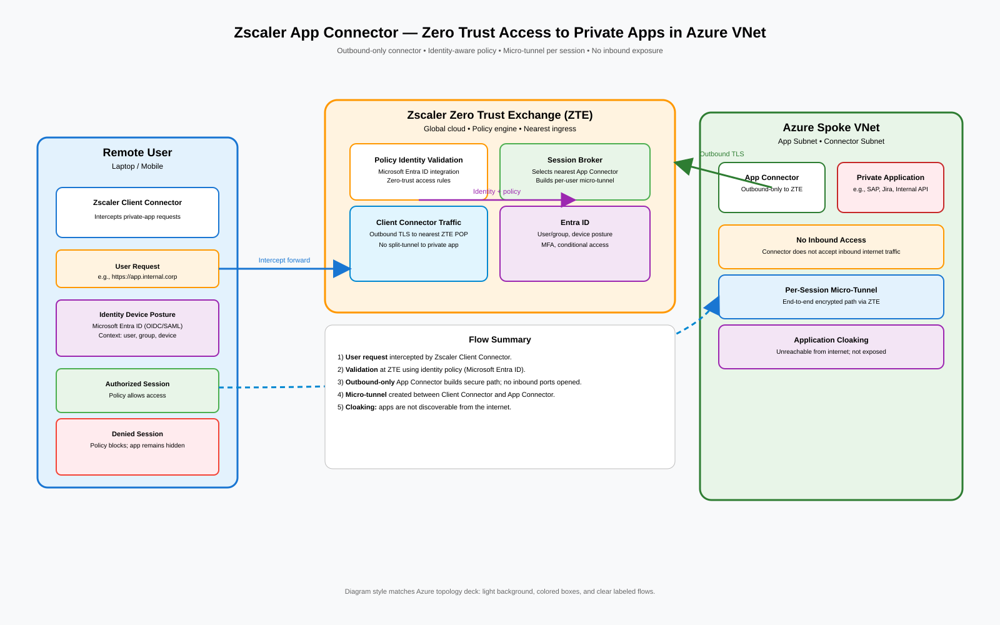

## Network architecture diagrams

### Environment topology

  

### Branch to Azure (ExpressRoute)

  

### Internet egress via hub NVA

  

### Hybrid DNS resolution

  

### Encryption and TLS

  

### Multi-cloud connectivity (Equinix ECX Fabric)

  

  

### NetBox integration

  

### Zscaler overview

  

