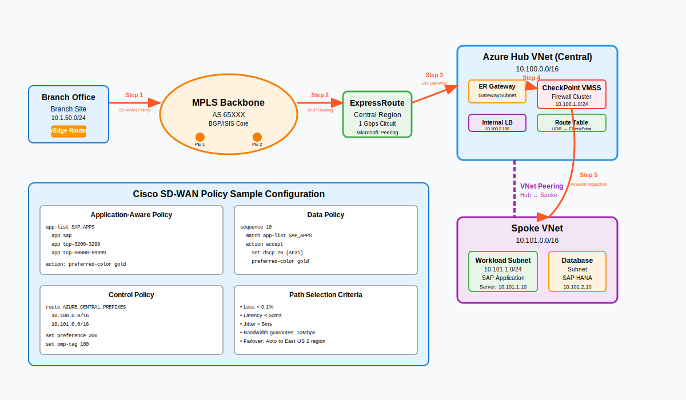

# Branch → Azure (ExpressRoute / SD-WAN)

Connect enterprise branches to Azure through a regional **hub-and-spoke** landing zone using **ExpressRoute (ER)** and optional **SD-WAN** integration. This pattern centralizes egress/ingress, inspection, and shared services while keeping app spokes clean and least-privilege.



---

## Why this pattern

- **Deterministic connectivity:** Private circuits (ER) avoid the public Internet for east–west and north–south flows.
- **Centralized security:** NVAs (FortiGate/Check Point) in the hub enforce L3–L7 controls; spokes stay thin.
- **Scales cleanly:** Add spokes per app/team; policy, logging, and routing stay in the hub.
- **Carrier flexibility:** Works with MPLS, DIA + SD-WAN, or dual-provider ER.

---

## Reference topology

- **Branch WAN** → (MPLS/SD-WAN) → **ER Provider Edge (PE)**
- **ExpressRoute Circuit** → **Azure ER Gateway** in **Hub VNet**
- **Hub VNet subnets**: `GatewaySubnet`, `AzureFirewallSubnet` (optional), `RouteServerSubnet` (optional), `nva-inspection`, `shared-services`
- **NVA VMSS** in `nva-inspection` for inline inspection
- **Spoke VNets** for workloads; **peered** to Hub (no direct spoke↔spoke)
- **Central egress** via hub NVA/Firewall; **ingress** via Front Door / ALB + Private Link (separate pattern)

---

## Traffic flows

1. **Branch → Spoke (private app):**
   - Branch → ER → Hub Gateway → UDR to NVA → Spoke
   - Return via NVA (asymmetric routing avoided with symmetric UDRs)

2. **Spoke → Internet (egress):**  
   Spoke default route `0.0.0.0/0` → Hub NVA → Internet

3. **Branch ↔ Shared Services:**  
   Branch → ER → Hub → `shared-services` (DNS, PKI, logging, jump)

> **Note**: Spoke↔spoke is via Hub NVA; do not peer spokes to each other.

---

## Routing & UDRs (minimal)

| Scope        | Prefix             | Next hop        | Notes                         |
|--------------|--------------------|-----------------|-------------------------------|
| Spoke UDR    | 0.0.0.0/0          | Hub NVA (ILB)   | Force egress via Hub          |
| Spoke UDR    | Branch CIDRs       | Hub NVA (ILB)   | Branch→Spoke via inspection   |
| Hub NVA UDR  | Spoke CIDRs        | VNet peering    | Return to spokes              |
| Hub NVA UDR  | Branch CIDRs       | ER Gateway      | Return to branches            |

> Use an **internal load balancer (ILB)** in front of NVA VMSS to keep next-hops stable.

---

## Security controls

- **L3–L7 inspection** at NVA (IPS, TLS inspection where policy allows).
- **NSGs**: Deny by default on Hub and Spokes; open only app ports.
- **Private DNS**: Central zones, linked to Hub and Spokes.
- **Key Vault**: Certs/keys for TLS intercept, app secrets (no secrets on NVAs).
- **Logging**: NVA, NSG flow logs, and Gateway diagnostics → **Log Analytics** / **Sentinel**.

!!! tip "Zero Trust alignment"
    - **Policy decision** at NVA/WAF
    - **Micro-segmentation** via per-spoke NSGs/UDRs
    - **Continuous monitoring** via centralized logs

---

## Prerequisites

- Azure subscription with **Hub** landing zone RG
- ER circuit provisioned by provider (or plan to provision)
- IP plan (no overlaps with branches/spokes)
- Choice of NVA vendor & images (FortiGate/Check Point), and license plan

---

## Deploy options

=== "Bicep (hub core)"

```bicep
param location string = resourceGroup().location
param hubVnetName string = 'hub-vnet'
param hubCidr string = '10.0.0.0/16'
param erGatewaySubnet string = '10.0.255.0/27'
param nvaSubnet string = '10.0.1.0/24'

resource hub 'Microsoft.Network/virtualNetworks@2024-03-01' = {
  name: hubVnetName
  location: location
  properties: {
    addressSpace: { addressPrefixes: [hubCidr] }
    subnets: [
      { name: 'GatewaySubnet', properties: { addressPrefix: erGatewaySubnet } }
      { name: 'nva-inspection', properties: { addressPrefix: nvaSubnet } }
      // add AzureFirewallSubnet / RouteServerSubnet if needed
    ]
  }
}

output hubVnetId string = hub.id
