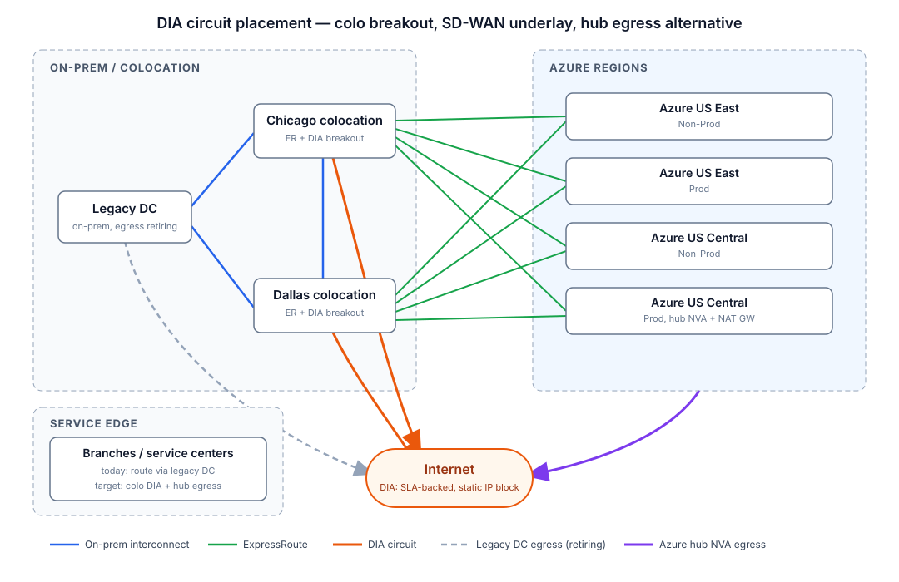

# DIA circuit (Dedicated Internet Access)

## Overview

A Dedicated Internet Access (DIA) circuit provides a site with an SLA-backed, symmetric internet handoff from a single provider — dedicated bandwidth, static public IP space, and BGP support, unlike shared broadband. In this architecture DIA circuits play three roles:

1. **Local internet breakout** at branches and the on-premises data center (the "on-prem DWAN DIA" and provider DIA options in [FR-04](../ARD.md)), offloading SaaS and trusted-destination traffic from the hub.
2. **SD-WAN underlay** carrying IPsec overlay tunnels to the Azure hub, serving as the resilient backup path to ExpressRoute.
3. **Alternate egress path** when policy or a failure event makes the Azure hub NVA egress unavailable.

---

## Topology context and migration

Internet egress today concentrates at the **legacy on-premises data center**: branch and service-edge sites route to it, and it holds the enterprise internet exit. The target state moves egress to the edges that will outlive it:

| Egress point | Today | Target |
| -------------- | ------- | -------- |
| Legacy DC | Primary internet exit for DC, branches, and service edge | Retired as applications migrate out |
| Chicago / Dallas colocations | Interconnect and ExpressRoute only | **DIA breakout** alongside the ER circuits into each Azure region (Prod and Non-Prod, US East and US Central) |
| Azure hub | N/A | [Hub NVA + NAT Gateway egress](internet-egress.md) for cloud-resident workloads |
| Branches / service edge | Backhaul to legacy DC | Colo DIA or hub egress via SD-WAN, selected per app |

Because both colocation facilities already terminate ExpressRoute to every Azure environment, adding DIA there gives each facility a complete exit: private path to Azure over ER, public path over DIA, with no dependency on the legacy DC. Branch connectivity shifts from DC backhaul to colocation and cloud endpoints as applications move — the DIA circuits are what make the colos viable egress points during and after that migration.

---

## When to use DIA

| Attribute | DIA | Broadband | MPLS / ExpressRoute |
| ----------- | ----- | ----------- | --------------------- |
| Bandwidth | Dedicated, symmetric (10 Mbps–100 Gbps) | Shared, asymmetric | Dedicated, symmetric |
| SLA | Availability, latency, jitter, MTTR | Best effort | Availability, latency |
| Public IPs | Static block (/29 or larger), BGP optional | Dynamic or single static | Private connectivity (no internet) |
| Typical role here | Branch breakout, SD-WAN underlay, VPN backup | Small-site underlay only | Primary private path to Azure |
| Lead time | 30–90 days (fiber build may extend this) | Days | 60–120 days |

Use DIA when a site needs deterministic internet performance — for SD-WAN tunnels toward Azure, latency-sensitive SaaS, or as the guaranteed underlay for the S2S VPN backup path. Broadband remains acceptable as a second, diverse underlay at small branches.

---

## Traffic flows

1. **Branch → SaaS (local breakout):** SD-WAN edge classifies the app, applies local security policy, NATs to the DIA static block, and forwards directly to the provider — never traversing the hub.
2. **Branch → Azure spoke (overlay over DIA):** SD-WAN edge encapsulates in IPsec, rides the DIA underlay to the Azure VPN Gateway (or SD-WAN hub NVA), then follows the standard hub inspection path to the spoke. Active only when ExpressRoute is down or de-preferred.
3. **On-prem → Internet (DC DIA egress):** Data-center workloads egress through the on-prem firewall and DWAN DIA circuit instead of hairpinning through Azure — the "on-prem DIA" option of the modular egress design.
4. **Return traffic:** Symmetric via the same circuit; the static IP block keeps third-party allowlists stable.

---

## Key components

| Component | Role | Notes |
| ----------- | ------ | ------- |
| DIA circuit | Dedicated internet handoff with SLA | Ethernet handoff (1G/10G), single provider end-to-end |
| Provider edge (PE) | ISP termination, BGP or static default | Request BGP when advertising your own PI space |
| Static IP block | Deterministic source NAT for allowlisting | /29 minimum; document in [NetBox](netbox-integration.md) |
| SD-WAN edge / CPE | Breakout policy, IPsec overlay, path selection | Dual-CPE for HA at critical sites |
| Edge firewall | L3–L7 inspection for direct breakout traffic | FortiGate at branch; full NGFW at DC |
| Azure VPN Gateway | Terminates IPsec backup tunnels over DIA | Zone-redundant SKU (`VpnGw2AZ`+) in the hub |
| IP transit SLA | Availability, latency, jitter, packet loss, MTTR | Track with SLA probes; automate failover on breach |

---

## Routing and failover

| Scope | Prefix | Primary next hop | Failover next hop |
| ------- | -------- | ------------------ | ------------------- |
| Branch LAN | `0.0.0.0/0` (trusted SaaS) | DIA local breakout | Overlay → hub NVA egress |
| Branch LAN | Azure spoke CIDRs | SD-WAN overlay via ER underlay | SD-WAN overlay via DIA underlay |
| Branch LAN | `0.0.0.0/0` (default) | Overlay → hub NVA egress | DIA local breakout (restricted policy) |
| DC core | `0.0.0.0/0` | DWAN DIA via DC firewall | Azure hub NVA via ExpressRoute |

- **Underlay selection:** SD-WAN measures loss/latency/jitter per underlay; ER-backed paths are preferred for Azure-bound traffic, DIA carries the overlay only on ER degradation.
- **BGP with the provider:** At the DC, run eBGP on the DIA circuit and advertise the PI block; prepend or use communities to keep the circuit as backup where required.
- **Asymmetry guard:** Keep NAT at the same edge that owns the circuit, so return traffic cannot arrive on a different path than it left.

> Failing over branch internet from local DIA breakout to hub egress changes the source IP seen by third parties. Keep both the DIA static block and the [hub NAT Gateway prefix](internet-egress.md) in external allowlists.

---

## Implementation notes

### Circuit ordering and diversity

- Order DIA from a **different carrier** (or at least diverse entrance facilities) than the ExpressRoute provider circuits, so one fiber cut cannot take down both the primary path and its backup underlay.
- Request the **LOA/CFA and demarc details** early; fiber builds are the long pole in the 30–90 day lead time.
- At Equinix-colocated sites, DIA can be delivered as a cross-connect from an IP transit provider in the same facility — days instead of months.

### Sizing

Size for the sum of local breakout traffic plus the full SD-WAN overlay load during an ExpressRoute failure — the backup underlay must carry primary-path traffic, not just steady-state breakout. Add IPsec overhead (~10%) when the circuit carries overlay tunnels.

### Handoff configuration

- 1G/10G Ethernet handoff, single-mode fiber preferred even at 1G (avoids re-cabling on upgrade).
- Set MTU deliberately: 1500 on the underlay means TCP MSS clamping (typically 1350–1387) on IPsec tunnels; ask the provider about jumbo support if available.
- Disable provider-managed CPE where possible — terminate directly on your SD-WAN edge or firewall to keep the demarc clean.

### Monitoring

- SLA probes (ICMP/HTTP) from the edge toward anchor targets through each underlay; feed results into the SD-WAN path-selection policy.
- Export circuit utilization and probe metrics to the central observability stack (Prometheus/Grafana per AR-07); alert at 70% sustained utilization to trigger upgrade planning.
- Record circuit ID, provider, bandwidth, demarc, and IP block in [NetBox](netbox-integration.md) as the source of truth.

---

## Security considerations

- **No naked breakout:** Every DIA circuit terminates behind an NGFW or SD-WAN edge with L3–L7 policy. Direct-to-internet traffic gets the same inspection classes (URL filtering, IPS, DNS security) as hub egress, or it goes through the hub.
- **Restricted split tunnel:** Local breakout is an explicit allowlist of SaaS destinations; the default route stays toward inspected egress. Review the breakout list as part of change control.
- **DDoS exposure:** DIA static IPs are internet-reachable. Keep inbound policy deny-by-default, drop unsolicited traffic at the edge, and confirm the provider's DDoS mitigation options for the circuit.
- **Zero Trust alignment (NIST SP 800-207):** Breakout decisions are per-app policy, not per-site trust; identity and device posture still gate access to Azure workloads regardless of which underlay carries the flow.
- **Logging:** Edge firewall and SD-WAN flow logs from DIA breakout sites ship to the central Log Analytics/Sentinel workspace so egress visibility stays uniform across hub and branch exits.

---

## Related patterns

- [Branch to Azure](branch-to-azure.md) - the ER/SD-WAN primary path this circuit backs up
- [Internet egress via hub NVA](internet-egress.md) - the centralized egress alternative to DIA breakout
- [Multi-cloud connectivity](multi-cloud-connectivity.md) - Equinix fabric where colo DIA cross-connects land
- [NetBox integration](netbox-integration.md) - circuit inventory and IPAM for DIA assets
