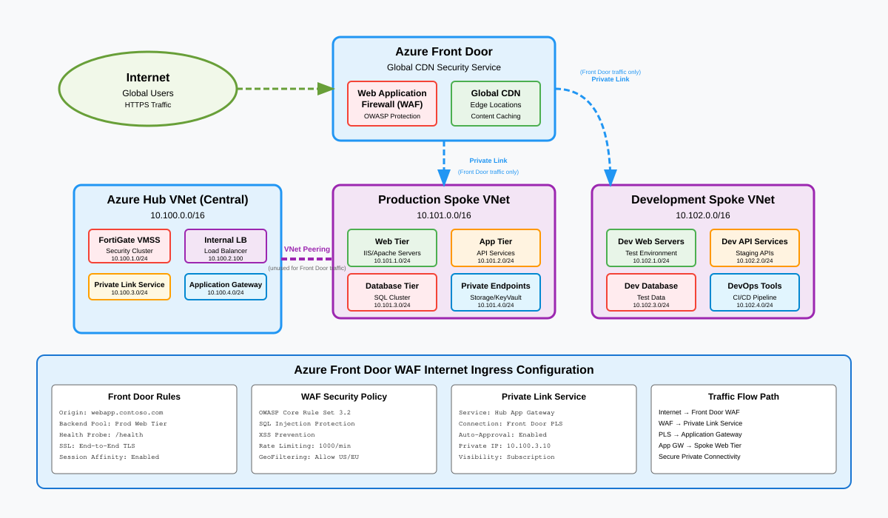

# Internet ingress via Front Door

## Overview

Global inbound traffic reaches Azure workloads through Azure Front Door with WAF protection, bypassing the hub NVA tier entirely via Private Link. This pattern provides low-latency global load balancing, DDoS absorption at the Microsoft edge, and origin cloaking so backend workloads are never directly exposed to the public internet.



---

## Traffic flow

1. **Client** sends HTTPS request to `app.newco.com`.
2. **DNS** resolves to Azure Front Door anycast IP (Microsoft global edge).
3. **Front Door WAF** evaluates the request against managed and custom rule sets (OWASP CRS, bot protection, geo-filtering, rate limiting).
4. **Front Door** selects the optimal origin based on latency probes and health checks.
5. **Private Link** connection from Front Door to the origin (internal load balancer or App Service) keeps traffic on the Microsoft backbone. No public IP needed on the origin.
6. **Origin load balancer** distributes to backend compute (VMSS, AKS, App Service).
7. **Response** returns through Front Door, which applies caching and compression rules.

> The hub NVA is intentionally bypassed for Front Door ingress. The NVA is designed for outbound and east-west inspection. Routing inbound web traffic through it would add latency and create a scaling bottleneck. WAF policy at Front Door provides the equivalent L7 protection for inbound flows.

---

## Key components

| Component | Role | Azure resource |
| ----------- | ------ | ---------------- |
| Azure Front Door Premium | Global L7 load balancing, SSL offload, caching | `Microsoft.Cdn/profiles` (Premium tier) |
| WAF policy | OWASP CRS 3.2, bot protection, custom rules | `Microsoft.Network/frontDoorWebApplicationFirewallPolicies` |
| Private Link service | Origin cloaking, backbone-only connectivity | `Microsoft.Network/privateLinkServices` |
| Private endpoint | Front Door connection into spoke VNet | `Microsoft.Network/privateEndpoints` |
| Internal load balancer | Backend distribution in spoke | `Microsoft.Network/loadBalancers` (Standard, internal) |
| App Service (alternative) | PaaS origin with built-in Private Link support | `Microsoft.Web/sites` |
| Azure DNS | CNAME to Front Door endpoint, plus validation TXT | `Microsoft.Network/dnsZones` |

---

## Architecture decisions

### Why Private Link instead of public origin

| | Public origin | Private Link origin |
| -- | -------------- | ------------------- |
| Origin IP exposure | Public IP required, discoverable | No public IP, fully cloaked |
| Traffic path | Front Door -> internet -> origin PIP | Front Door -> Microsoft backbone -> PE |
| NSG requirements | Must allow Front Door service tag | Only private traffic, deny all public |
| DDoS surface | Origin PIP is attackable | No public surface to attack |

Private Link is the recommended approach for all production workloads.

### WAF policy design

Apply a base WAF policy at the Front Door profile level, then override per-route where applications need specific exclusions. Use prevention mode for production and detection mode during onboarding to tune false positives.

---

## Routing

No spoke UDR changes are needed for Front Door ingress. The Private Link connection terminates at a private endpoint in the spoke VNet, and return traffic follows the private endpoint's effective routes. The hub NVA default route (`0.0.0.0/0`) does not apply because the traffic never hits the spoke's route table as internet-sourced.

| Scope | Prefix | Next hop | Notes |
|-------|--------|----------|-------|
| Spoke UDR | (no entry needed) | - | Private Link traffic is backbone-routed |
| NSG on origin subnet | Allow from PE subnet | ILB/app port | Only traffic source is the private endpoint |

---

## Implementation notes

### Custom domain and TLS

Front Door manages certificate lifecycle for custom domains via Azure-managed certificates or customer Key Vault certificates. Use CNAME flattening (or `afdverify` prefix) to validate domain ownership before cutover.

### Health probes

Configure health probes on Front Door to hit a dedicated `/health` endpoint on the origin. Set probe interval to 30 seconds with a 3-probe failure threshold. This avoids probe traffic overwhelming thin backends.

### Caching strategy

Enable caching for static assets (images, CSS, JS) with query string stripping. Disable caching for API routes and authenticated content. Use cache purge API integration in CI/CD pipelines for deployments.

### Bicep snippet (Front Door + Private Link origin)

```bicep
param location string = resourceGroup().location

resource afd 'Microsoft.Cdn/profiles@2024-02-01' = {
  name: 'newco-frontdoor'
  location: 'global'
  sku: { name: 'Premium_AzureFrontDoor' }
}

resource endpoint 'Microsoft.Cdn/profiles/afdEndpoints@2024-02-01' = {
  parent: afd
  name: 'newco-web'
  location: 'global'
  properties: { enabledState: 'Enabled' }
}

resource originGroup 'Microsoft.Cdn/profiles/originGroups@2024-02-01' = {
  parent: afd
  name: 'newco-origins'
  properties: {
    loadBalancingSettings: {
      sampleSize: 4
      successfulSamplesRequired: 3
    }
    healthProbeSettings: {
      probePath: '/health'
      probeProtocol: 'Https'
      probeIntervalInSeconds: 30
    }
  }
}
```

---

## Security considerations

- **Zero Trust alignment (NIST SP 800-207):** Front Door WAF acts as the policy enforcement point for all inbound web traffic. Private Link ensures that even if WAF is misconfigured, origins have no public attack surface.
- **Origin cloaking:** Remove or never create public IPs on origin resources. NSGs on the origin subnet should deny all inbound except from the private endpoint subnet.
- **Bot protection:** Enable the bot manager rule set on Front Door Premium to block known-bad bots and challenge suspicious automated traffic.
- **Logging:** Enable Front Door diagnostic logs (access logs, WAF logs, health probe logs) to Log Analytics. Correlate with origin application logs using `X-Azure-Ref` header.
- **Rate limiting:** Apply rate limit rules at Front Door to absorb volumetric L7 attacks before they reach origins.

---

## Related patterns

- [Internet egress](internet-egress.md) - outbound path for the same spoke workloads
- [Branch to Azure](branch-to-azure.md) - how internal users reach the same backends via ExpressRoute
- [Region-to-region transit](region-transit.md) - failover routing when the primary region origin is unhealthy
