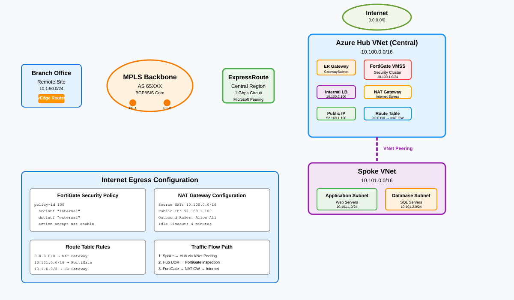

# Internet egress via hub NVA

## Overview

Centralized outbound internet access for all spoke workloads through a hub VNet NVA inspection tier. Spoke route tables force `0.0.0.0/0` to the hub, where FortiGate or CheckPoint NVA clusters apply L3-L7 security policy before traffic exits through Azure NAT Gateway. This pattern eliminates the need for per-spoke internet breakouts and provides a single auditable egress point.



---

## Traffic flow

1. **Spoke workload** initiates an outbound connection (e.g., API call, OS update, SaaS integration).
2. **Spoke UDR** `0.0.0.0/0 -> Hub NVA ILB` forwards the packet to the hub VNet.
3. **Internal load balancer (ILB)** distributes traffic across the NVA VMSS instances (active-active).
4. **NVA inspection** applies URL filtering, IPS signatures, TLS inspection (where policy permits), and application-aware rules.
5. **Allowed traffic** is forwarded to the **NVA external interface** on the egress subnet.
6. **NAT Gateway** on the egress subnet translates the source IP to a deterministic public IP (useful for third-party allowlisting).
7. **Return traffic** follows the same path in reverse: NAT Gateway -> NVA -> ILB -> spoke.

---

## Key components

| Component | Role | Azure resource |
| ----------- | ------ | ---------------- |
| Hub VNet | Centralized transit and security | `Microsoft.Network/virtualNetworks` |
| NVA VMSS | Inline L3-L7 inspection (FortiGate/CheckPoint) | `Microsoft.Compute/virtualMachineScaleSets` |
| Internal load balancer | Stable next-hop for spoke UDRs, HA distribution | `Microsoft.Network/loadBalancers` (Standard, internal) |
| NAT Gateway | Deterministic outbound SNAT on egress subnet | `Microsoft.Network/natGateways` |
| Public IP prefix | Predictable egress IPs for allowlisting | `Microsoft.Network/publicIPPrefixes` |
| Spoke UDR | Forces default route to hub NVA | `Microsoft.Network/routeTables` |
| NSG | Deny-by-default baseline on all subnets | `Microsoft.Network/networkSecurityGroups` |
| Log Analytics workspace | NVA logs, NSG flow logs, NAT Gateway metrics | `Microsoft.OperationalInsights/workspaces` |

---

## Routing

| Scope | Prefix | Next hop | Notes |
| ------- | -------- | ---------- | ------- |
| Spoke UDR | `0.0.0.0/0` | Hub NVA ILB | All internet-bound traffic through hub |
| Spoke UDR | Hub VNet CIDR | Hub NVA ILB | Spoke-to-hub inspection |
| NVA egress subnet UDR | `0.0.0.0/0` | Internet | NAT Gateway handles SNAT |
| NVA internal subnet UDR | Spoke CIDRs | VNet peering | Return path to spokes |

> Set `disableBgpRoutePropagation = true` on all spoke route tables to prevent learned routes from bypassing the NVA.

---

## Implementation notes

### NVA sizing

Scale the VMSS based on aggregate spoke egress throughput. FortiGate VM16 supports up to 20 Gbps per instance with accelerated networking enabled. Start with a minimum of two instances for zone redundancy.

### NAT Gateway considerations

Each NAT Gateway supports up to 64,512 SNAT ports per public IP. Attach a public IP prefix (/28 or /27) to scale beyond single-IP limits. All spokes share the same egress IPs, simplifying third-party firewall allowlists.

### Forced tunneling from on-premises

When ExpressRoute advertises `0.0.0.0/0` from on-premises, Azure-originated internet traffic routes back through the branch. To keep cloud egress local, use a more specific UDR (`0.0.0.0/1` and `128.0.0.0/1`) pointing to the NVA, which takes precedence over the BGP-learned default.

### Bicep snippet (NAT Gateway + egress subnet)

```bicep
param location string = resourceGroup().location

resource natPip 'Microsoft.Network/publicIPAddresses@2024-03-01' = {
  name: 'newco-egress-pip'
  location: location
  sku: { name: 'Standard' }
  properties: { publicIPAllocationMethod: 'Static' }
}

resource natGw 'Microsoft.Network/natGateways@2024-03-01' = {
  name: 'newco-egress-natgw'
  location: location
  sku: { name: 'Standard' }
  properties: {
    publicIpAddresses: [{ id: natPip.id }]
    idleTimeoutInMinutes: 4
  }
}
```

---

## Security considerations

- **Zero Trust alignment (NIST SP 800-207):** Every outbound flow is inspected regardless of source spoke or workload identity. The NVA acts as the policy enforcement point for all internet-bound traffic.
- **TLS inspection:** Deploy with caution. Requires distributing the NVA CA certificate to all spoke workloads. Exempt sensitive endpoints (banking, healthcare portals) via FQDN bypass lists.
- **Logging:** NVA syslog, NSG flow logs (v2), and NAT Gateway metrics should all feed into a central Log Analytics workspace. Set up alerts for SNAT port exhaustion and NVA CPU > 80%.
- **DDoS protection:** Enable Azure DDoS Protection Standard on the hub VNet to protect the NAT Gateway public IPs.

---

## Related patterns

- [Branch to Azure](branch-to-azure.md) - how branch traffic reaches spoke workloads through the same hub
- [DIA circuit](dia-circuit.md) - decentralized breakout at colo and branch edges that complements hub egress
- [Front Door ingress](front-door-ingress.md) - inbound path that bypasses the hub NVA via Private Link
- [Region-to-region transit](region-transit.md) - cross-region traffic that also traverses hub NVAs
