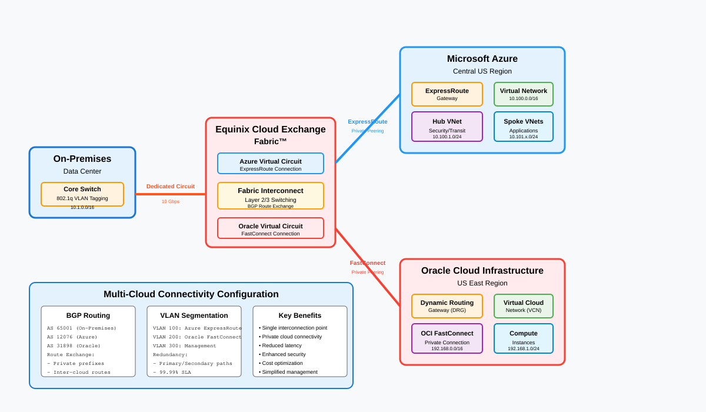

# Multi-cloud connectivity via Equinix ECX Fabric

## Overview

Private cross-cloud connectivity between Azure and Oracle Cloud Infrastructure (OCI) using Equinix ECX Fabric as the interconnection layer. Traffic between clouds stays on private circuits through Equinix, never touching the public internet. The Azure side terminates on the existing hub ExpressRoute gateway, maintaining NVA inspection for all cross-cloud flows.



---

## Traffic flow

### Azure to OCI

1. **Spoke workload (Azure)** initiates a connection to an OCI-hosted service.
2. **Spoke UDR** forwards traffic to the **hub NVA ILB** (`0.0.0.0/0` or OCI-specific prefix).
3. **Hub NVA** inspects and applies L3-L7 policy, then forwards to the **ExpressRoute gateway**.
4. **ExpressRoute circuit** carries traffic to the **Equinix ECX Fabric** metro interconnect.
5. **ECX Fabric virtual connection** routes traffic to the **OCI FastConnect** virtual circuit.
6. **OCI DRG (Dynamic Routing Gateway)** distributes to the target VCN and subnet.
7. **Return traffic** follows the reverse path with symmetric inspection at the Azure hub NVA.

### OCI to Azure

1. **OCI workload** initiates a connection to an Azure spoke resource.
2. Traffic traverses **FastConnect** to **ECX Fabric** to **ExpressRoute**.
3. **ExpressRoute gateway** delivers to the hub VNet.
4. **Hub UDR** routes to the **NVA ILB** for inspection before forwarding to the destination spoke.

---

## Key components

| Component | Role | Platform |
| ----------- | ------ | ---------- |
| ExpressRoute circuit | Private connectivity from Azure hub to Equinix | Azure `Microsoft.Network/expressRouteCircuits` |
| ExpressRoute gateway | Circuit termination in hub GatewaySubnet | Azure `Microsoft.Network/virtualNetworkGateways` |
| Equinix ECX Fabric | Cloud-neutral interconnection layer | Equinix portal / API |
| ECX Fabric virtual connection | L2 connection stitching Azure ER to OCI FastConnect | Equinix |
| OCI FastConnect | Private connectivity from Equinix to OCI | OCI `oci_core_virtual_circuit` |
| OCI DRG | Dynamic Routing Gateway, OCI transit hub | OCI `oci_core_drg` |
| NVA VMSS | Inline inspection of cross-cloud traffic at Azure hub | Azure `Microsoft.Compute/virtualMachineScaleSets` |
| Hub ILB | Stable next-hop for UDRs targeting cross-cloud prefixes | Azure `Microsoft.Network/loadBalancers` |

---

## Routing

| Scope | Prefix | Next hop | Notes |
| ------- | -------- | ---------- | ------- |
| Spoke UDR | OCI VCN CIDRs | Hub NVA ILB | Cross-cloud traffic through inspection |
| Hub NVA UDR | OCI VCN CIDRs | ExpressRoute gateway | Post-inspection forward to Equinix |
| Hub GatewaySubnet UDR | Spoke CIDRs | NVA ILB | OCI-initiated traffic through NVA |
| OCI VCN route table | Azure spoke CIDRs | DRG | Route to FastConnect attachment |

> BGP route exchange between ExpressRoute and OCI FastConnect happens through Equinix ECX Fabric. Ensure AS path filtering prevents route leaks between clouds.

---

## Implementation notes

### Equinix ECX Fabric setup

Provision a virtual connection in ECX Fabric that bridges the Azure ExpressRoute service key to the OCI FastConnect partner port. Both sides must be in the same Equinix metro (e.g., Ashburn for East US, Dallas for Central US). Typical provisioning time is 15-30 minutes per side.

### Bandwidth planning

ECX Fabric virtual connections are available in 50 Mbps to 10 Gbps increments. Match the virtual connection speed to the ExpressRoute circuit SKU. OCI FastConnect supports 1 Gbps and 10 Gbps ports.

### BGP peering

ExpressRoute private peering uses ASN 12076 (Microsoft). OCI FastConnect uses Oracle's ASN. Configure BGP communities to tag cross-cloud routes for policy differentiation at the NVA.

### Redundancy

Deploy dual virtual connections through two different Equinix metros (e.g., Ashburn + Dallas) for geographic redundancy. Each virtual connection maps to a separate ExpressRoute circuit and OCI FastConnect.

### Bicep snippet (ExpressRoute circuit for Equinix)

```bicep
param location string = resourceGroup().location

resource erCircuit 'Microsoft.Network/expressRouteCircuits@2024-03-01' = {
  name: 'newco-equinix-multicloud'
  location: location
  sku: {
    name: 'Standard_MeteredData'
    tier: 'Standard'
    family: 'MeteredData'
  }
  properties: {
    serviceProviderProperties: {
      serviceProviderName: 'Equinix'
      peeringLocation: 'Dallas'
      bandwidthInMbps: 1000
    }
  }
}

output serviceKey string = erCircuit.properties.serviceKey
```

---

## Security considerations

- **Zero Trust alignment (NIST SP 800-207):** All cross-cloud traffic traverses the hub NVA policy enforcement point. No direct peering between spokes and OCI bypasses inspection.
- **Encryption in transit:** ExpressRoute and FastConnect provide L2 isolation but not encryption. For sensitive workloads, layer IPSec tunnels between NVA and OCI network appliances over the private circuit.
- **Route filtering:** Apply strict BGP prefix filters at both the ExpressRoute and FastConnect sessions to prevent unintended route advertisements between clouds.
- **Logging:** Correlate NVA logs for cross-cloud flows with OCI VCN flow logs in a unified SIEM (Sentinel or equivalent). Tag cross-cloud flows with BGP community values for easier filtering.
- **Blast radius:** A misconfigured OCI route table could attract Azure traffic. Use maximum-prefix limits on BGP sessions and alert on unexpected route count changes.

---

## Related patterns

- [Branch to Azure](branch-to-azure.md) - branch traffic shares the same ExpressRoute gateway
- [Internet egress](internet-egress.md) - outbound internet path for workloads that also use cross-cloud connectivity
- [Region-to-region transit](region-transit.md) - cross-region traffic within Azure, complementary to cross-cloud
