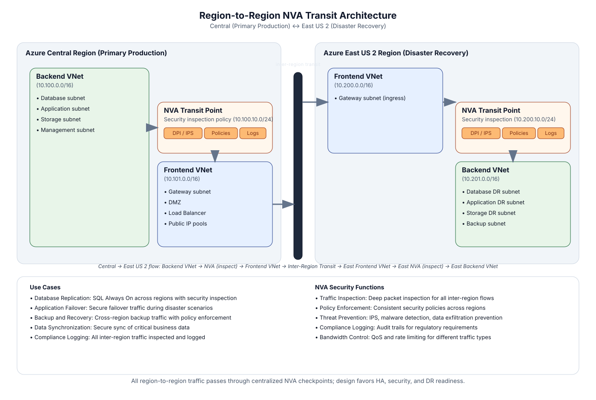

# Region-to-region transit

## Overview

Multi-region architecture where traffic between Central US (primary) and East US 2 (secondary) traverses hub NVAs in both regions. Global VNet peering connects the two hub VNets, and each region maintains independent frontend/backend spoke separation with NVA inspection at every boundary. This pattern supports active-active workloads, disaster recovery failover, and cross-region data replication with consistent security policy enforcement.



---

## Traffic flow

### Cross-region spoke-to-spoke

1. **Spoke A (Central US)** workload initiates a connection to **Spoke B (East US 2)**.
2. **Spoke A UDR** sends traffic to the **Central US hub NVA** (via ILB).
3. **Central US NVA** inspects and forwards to the **East US 2 hub** via global VNet peering.
4. **East US 2 hub UDR** routes traffic to the **East US 2 NVA** (via ILB) for a second inspection.
5. **East US 2 NVA** forwards to **Spoke B**.
6. **Return traffic** follows the reverse path, ensuring symmetric inspection at both hubs.

### Cross-region replication (database tier)

1. **Backend spoke (Central US)** SQL/Cosmos DB initiates replication to **backend spoke (East US 2)**.
2. Traffic follows the same dual-NVA path, ensuring data-in-transit is inspected at both region boundaries.
3. For high-throughput replication, NVA policy can allowlist known replication endpoints with reduced inspection depth (skip TLS decrypt, keep IPS).

---

## Key components

| Component | Role | Azure resource |
| ----------- | ------ | ---------------- |
| Hub VNet (Central US) | Primary region transit and inspection | `Microsoft.Network/virtualNetworks` |
| Hub VNet (East US 2) | Secondary region transit and inspection | `Microsoft.Network/virtualNetworks` |
| Global VNet peering | Backbone connectivity between hubs | `Microsoft.Network/virtualNetworks/virtualNetworkPeerings` |
| NVA VMSS (per region) | L3-L7 inspection at each region boundary | `Microsoft.Compute/virtualMachineScaleSets` |
| ILB (per region) | Stable next-hop, HA across NVA instances | `Microsoft.Network/loadBalancers` (Standard, internal) |
| Frontend spoke VNets | Web tier, API gateways, public-facing workloads | `Microsoft.Network/virtualNetworks` |
| Backend spoke VNets | Databases, internal services, storage | `Microsoft.Network/virtualNetworks` |
| Azure Monitor | Cross-region latency, NVA throughput, peering metrics | `Microsoft.Insights/metricAlerts` |

---

## Routing

### Central US hub

| Scope | Prefix | Next hop | Notes |
| ------- | -------- | ---------- | ------- |
| Hub UDR | East US 2 spoke CIDRs | Global peering | Cross-region forward |
| Hub UDR | Central US spoke CIDRs | NVA ILB | Local spoke inspection |
| Spoke UDR | `0.0.0.0/0` | NVA ILB | Egress and cross-region via hub |
| Spoke UDR | East US 2 CIDRs | NVA ILB | Cross-region through local NVA first |

### East US 2 hub

Mirrors the Central US routing table with region CIDRs swapped.

> Both hubs must have `disableBgpRoutePropagation = true` on spoke route tables. Global peering does not transitively advertise spoke routes, so all cross-region paths are UDR-driven.

---

## Frontend/backend separation

Each region maintains two tiers of spokes:

| Tier | Purpose | Connectivity | Example workloads |
| ------ | --------- | ------------- | ------------------- |
| Frontend spoke | Public-facing services | Receives traffic from Front Door via Private Link; sends to backend via hub NVA | API gateways, web apps, CDN origins |
| Backend spoke | Data and internal services | No direct internet access; only reachable through frontend via hub NVA | SQL databases, Cosmos DB, internal APIs, storage accounts |

Frontend-to-backend traffic within the same region still traverses the hub NVA. There is no direct peering between frontend and backend spokes.

---

## Implementation notes

### Global peering costs

Global VNet peering is billed per GB transferred (~$0.035/GB cross-region). For high-throughput replication workloads, evaluate whether the inspection overhead justifies the cost, or if an NVA allowlist for known replication flows can reduce processing load without compromising security posture.

### NVA policy synchronization

Both regions must enforce identical security policy. Use a centralized management plane (FortiManager or CheckPoint SmartConsole) to push policy to both NVA clusters simultaneously. Drift between regions creates compliance gaps.

### Failover design

- **Active-active:** Both regions serve traffic. Front Door routes to the closest healthy origin. Cross-region replication keeps data consistent.
- **Active-passive:** Secondary region is warm standby. Recovery involves DNS cutover (Front Door handles this automatically) and promoting read replicas.
- **RTO target:** < 60 seconds for Front Door-based failover. Database promotion is workload-dependent.

### Latency budget

Central US to East US 2 round-trip latency is approximately 35-45ms over global VNet peering. Adding dual NVA inspection adds 1-3ms per hop depending on policy complexity. Total cross-region path: ~40-50ms.

### Bicep snippet (global peering)

```bicep
resource peerCentralToEast 'Microsoft.Network/virtualNetworks/virtualNetworkPeerings@2024-03-01' = {
  name: 'hub-centralus-to-hub-eastus2'
  parent: hubCentralUs
  properties: {
    remoteVirtualNetwork: { id: hubEastUs2.id }
    allowVirtualNetworkAccess: true
    allowForwardedTraffic: true
    allowGatewayTransit: false
    useRemoteGateways: false
  }
}

resource peerEastToCentral 'Microsoft.Network/virtualNetworks/virtualNetworkPeerings@2024-03-01' = {
  name: 'hub-eastus2-to-hub-centralus'
  parent: hubEastUs2
  properties: {
    remoteVirtualNetwork: { id: hubCentralUs.id }
    allowVirtualNetworkAccess: true
    allowForwardedTraffic: true
    allowGatewayTransit: false
    useRemoteGateways: false
  }
}
```

---

## Security considerations

- **Zero Trust alignment (NIST SP 800-207):** Dual inspection ensures no cross-region flow bypasses policy enforcement. Even trusted replication traffic is subject to IPS at both boundaries.
- **Segmentation:** Frontend/backend separation prevents lateral movement. A compromised frontend workload cannot directly reach the database tier without traversing the hub NVA and passing L7 inspection.
- **Encryption in transit:** Global VNet peering traffic is encrypted on the Microsoft backbone (MACsec at the physical layer). For additional assurance, enable IPSec between NVA pairs for application-layer encryption.
- **Logging:** Correlate NVA logs from both regions in a single Log Analytics workspace. Use cross-region flow analysis to detect anomalous lateral movement patterns.
- **Blast radius containment:** If one region's NVA cluster is compromised, the other region's NVA provides an independent inspection boundary. Policy should be managed from a separate control plane, not from the NVA data plane.

---

## Related patterns

- [Branch to Azure](branch-to-azure.md) - how branch traffic enters each region's hub
- [Internet egress](internet-egress.md) - outbound path from spokes in each region
- [Front Door ingress](front-door-ingress.md) - global ingress that selects between regions based on health
